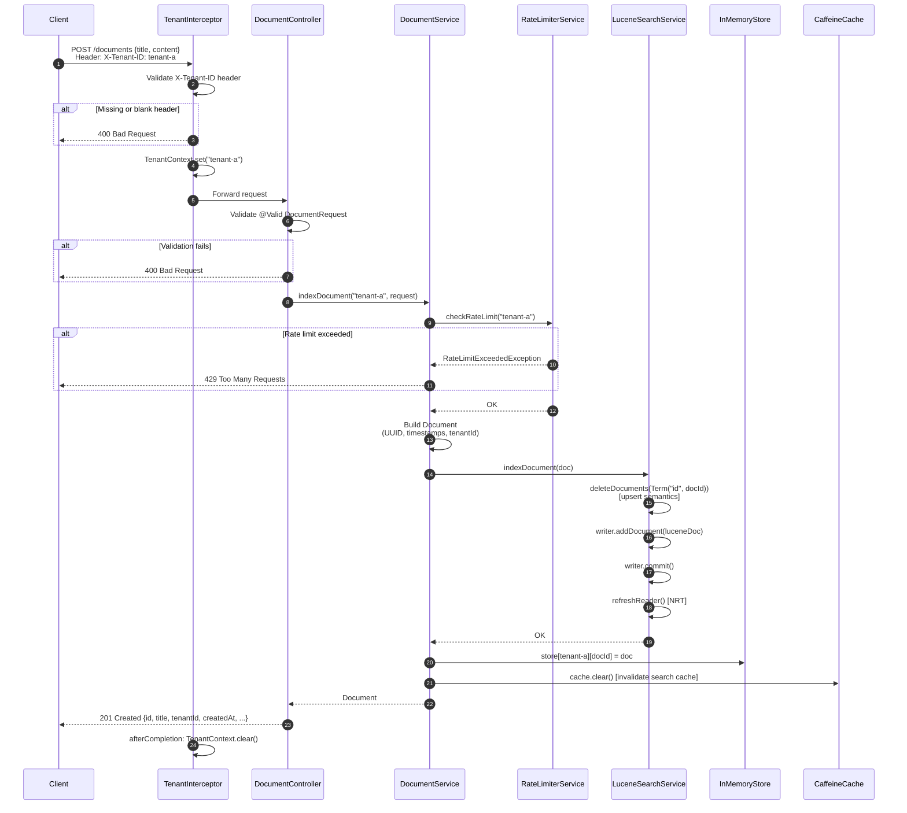
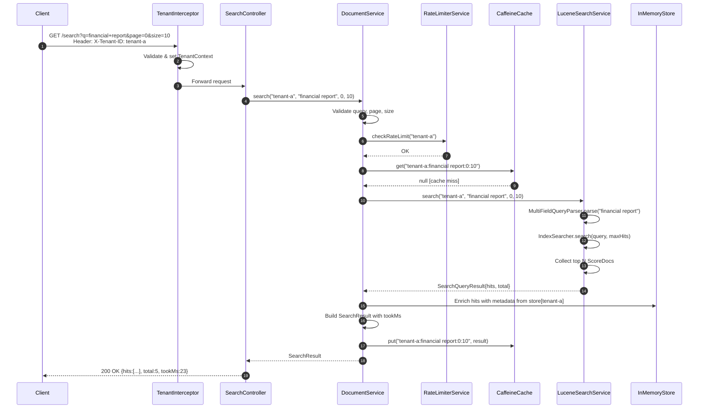
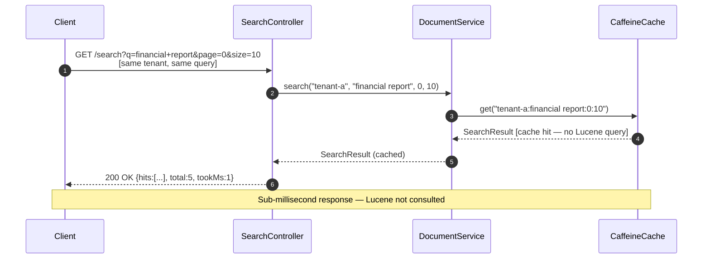
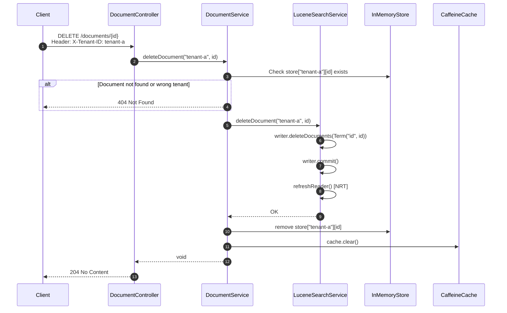
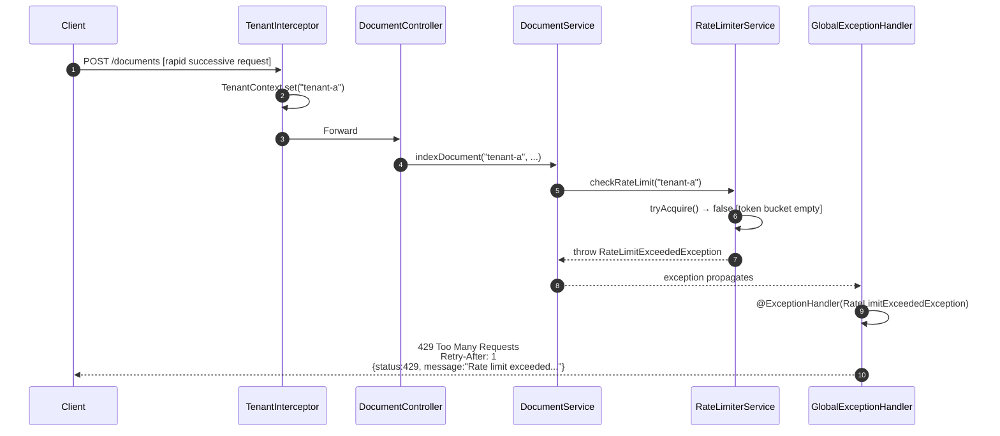
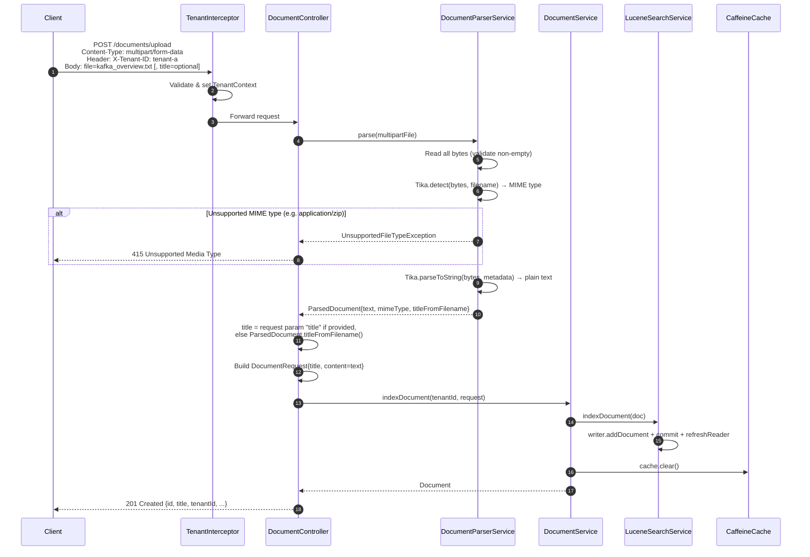

# Design Document — Distributed Document Search Service

> **Version:** 1.0 | **Author:** Platform Engineering | **Date:** May 2026

---

## Table of Contents

1. [Problem Statement](#1-problem-statement)
2. [Requirements](#2-requirements)
3. [Technology Stack & Rationale](#3-technology-stack--rationale)
4. [High-Level Architecture](#4-high-level-architecture)
5. [Component Descriptions](#5-component-descriptions)
6. [Data Models](#6-data-models)
7. [API Contract](#7-api-contract)
8. [Sequence Diagrams](#8-sequence-diagrams)
9. [Multi-Tenancy Design](#9-multi-tenancy-design)
10. [Caching Strategy](#10-caching-strategy)
11. [Rate Limiting Design](#11-rate-limiting-design)
12. [Trade-offs & Prototype Scope](#12-trade-offs--prototype-scope)
13. [Production Readiness Gap Analysis](#13-production-readiness-gap-analysis)

---

## 1. Problem Statement

Enterprise organizations need a search service capable of:

- Indexing and querying **10+ million documents** across multiple tenants
- Returning results in **< 500 ms** at the 95th percentile
- Handling **1,000+ concurrent searches/second**
- Enforcing **strict tenant data isolation** (no cross-tenant data leakage)
- Scaling **horizontally** as document volume and traffic grow

This document describes the architecture and design decisions for a prototype implementation that demonstrates enterprise-grade patterns while remaining runnable on a developer laptop.

---

## 2. Requirements

### Functional
| # | Requirement |
|---|---|
| F1 | Index a document (POST /documents) |
| F2 | Full-text search with relevance ranking (GET /search) |
| F3 | Retrieve a document by ID (GET /documents/{id}) |
| F4 | Delete a document (DELETE /documents/{id}) |
| F5 | Health check with dependency status (GET /health) |
| F6 | Tenant isolation — a tenant can only access their own documents |
| F7 | Upload and index files (POST /documents/upload) — PDF, DOCX, XLSX, PPTX, TXT, HTML, RTF, ODT |

### Non-Functional
| # | Requirement | Target |
|---|---|---|
| NF1 | Search latency (P95) | < 500 ms |
| NF2 | Concurrent searches | 1,000+ RPS |
| NF3 | Document scale | 10M+ documents |
| NF4 | Availability | 99.95% |
| NF5 | Rate limiting | Configurable per-tenant RPS cap |

---

## 3. Technology Stack & Rationale

### 3.1 Java 17 + Spring Boot 3.3

**Why Java 17?**
- Long-Term Support (LTS) release — production-stable through 2029
- Records, sealed classes, pattern matching reduce boilerplate
- Required by Spring Boot 3.x

**Why Spring Boot 3?**
- De-facto standard for enterprise REST services on the JVM
- Auto-configures web, cache, validation, actuator with zero XML
- Built-in support for `@Valid`, `@RestControllerAdvice`, `HandlerInterceptor`
- Native GraalVM compilation support for future cold-start optimisation

**Alternatives considered:**
- *Quarkus* — better cold-start, less mature ecosystem for this use case
- *Micronaut* — compile-time DI is compelling but adds tooling complexity
- *Go (net/http)* — faster raw performance but smaller search library ecosystem

---

### 3.2 Apache Lucene 9.10 (Embedded)

**Why Lucene?**
- Industry-standard full-text search engine used inside Elasticsearch and Solr
- **Embedded** — no external process/cluster required for the prototype
- `ByteBuffersDirectory` provides fully in-memory indexes — zero I/O overhead
- Per-tenant `Directory` instances give natural data isolation at the storage layer
- Near-Real-Time (NRT) reads via `DirectoryReader.openIfChanged()` — documents are searchable within milliseconds of indexing
- Supports full Lucene query syntax: boolean operators, field-specific search, wildcards, fuzzy matching, phrase queries

**Key Lucene concepts used:**

| Concept | Purpose |
|---|---|
| `ByteBuffersDirectory` | In-memory index storage per tenant |
| `IndexWriter` | Write/delete documents; kept open per tenant |
| `DirectoryReader` (NRT) | Read-side, refreshed after each write |
| `MultiFieldQueryParser` | Search across `title` and `content` simultaneously |
| `StandardAnalyzer` | Tokenisation, lowercasing, stop-word removal |
| `TextField` | Indexed + stored field (tokenised for FTS) |
| `StringField` | Indexed + stored field (exact match, e.g. document ID) |

**Alternatives considered:**
- *Elasticsearch* — better for production at scale; adds Docker dependency and operational overhead for a prototype
- *PostgreSQL Full-Text Search* — simpler to operate but limited query expressiveness and lower throughput
- *Meilisearch* — excellent developer UX but requires external process

---

### 3.3 Caffeine (In-Memory Cache)

**Why Caffeine?**
- Consistently the **fastest** JVM cache in benchmarks (outperforms Guava Cache, Ehcache)
- Native Spring Cache abstraction integration (`CaffeineCacheManager`)
- Window-TinyLFU eviction algorithm — better hit rate than LRU under typical workloads
- Configurable: max size (1,000 entries) + TTL (5 minutes) + stats recording

**Cache key design:**
```
{tenantId}:{query}:{page}:{pageSize}
```
Ensures cache entries are tenant-scoped and query-specific.

**Invalidation strategy:** Any write operation (index or delete) calls `cache.clear()`. This is a broad invalidation — sufficient for the prototype. Production would use tenant-scoped eviction (see §12).

**Alternatives considered:**
- *Redis* — production choice for shared cache across instances; adds infrastructure for prototype
- *Ehcache* — mature but heavier; Caffeine is simpler and faster

---

### 3.4 Guava RateLimiter

**Why Guava RateLimiter?**
- **Token bucket** algorithm — smooth, burst-aware rate control
- Per-tenant isolation: each tenant gets an independent `RateLimiter` instance
- `tryAcquire()` is non-blocking — returns `false` immediately if no token is available, enabling instant 429 responses without thread starvation
- Zero external dependencies (Guava is already a common transitive dependency)

**Algorithm:**
```
tokens_available(t) = min(capacity, stored + rate × elapsed_time)
tryAcquire() → true if tokens_available ≥ 1, else false
```

**Alternatives considered:**
- *Bucket4j* — more feature-rich (distributed rate limiting), overkill for prototype
- *Resilience4j RateLimiter* — good for circuit-breaker patterns; heavier dependency
- *Custom semaphore* — not burst-aware, harder to reason about

---

### 3.5 SpringDoc OpenAPI 2 (Swagger UI)

**Why SpringDoc?**
- Auto-generates OpenAPI 3.0 spec from Spring MVC annotations at runtime
- Serves interactive Swagger UI at `/swagger-ui/index.html` — zero configuration
- Supports `@Operation`, `@Parameter`, `@ApiResponse`, `@Schema` for rich documentation
- Compatible with Spring Boot 3 (SpringDoc 2.x uses Jakarta EE 9+ APIs)
- Security scheme support — renders the `X-Tenant-ID` Authorize dialog

**Alternatives considered:**
- *Springfox* — unmaintained, not compatible with Spring Boot 3
- *Manual OpenAPI YAML* — accurate but not auto-generated; drifts from code

---

### 3.6 Apache Tika 2.9

**Why Tika?**
- Industry-standard text extraction library used by Apache Solr and Elasticsearch
- Single API (`Tika.parseToString`) handles 20+ file formats: PDF, DOCX, XLSX, PPTX, HTML, RTF, ODT, plain text
- `AutoDetectParser` detects the MIME type from file bytes + filename extension and routes to the correct sub-parser automatically
- Passes filename metadata so format-ambiguous files (e.g. XML-based Office formats) are parsed correctly

**Key usage pattern:**
```java
String mimeType = tika.detect(bytes, filename);   // MIME check with filename hint
Metadata meta = new Metadata();
meta.set(TikaCoreProperties.RESOURCE_NAME_KEY, filename);
String text = tika.parseToString(new ByteArrayInputStream(bytes), meta);  // parse once
```

**Important dependency note:** `tika-parsers-standard-package` declares `tika-core` as `provided` scope, so `tika-core` must be listed as an explicit `compile`-scope dependency alongside it.

**Alternatives considered:**
- *Apache PDFBox (PDF only)* — single format; Tika gives us multi-format from one dependency
- *iText* — license restrictions; commercial use requires a paid licence
- *Manual per-format parsers* — significant maintenance overhead

---

### 3.7 Lombok

Reduces boilerplate for model classes. `@Data`, `@Builder`, `@NoArgsConstructor`, `@AllArgsConstructor` generate getters, setters, builders, and constructors at compile time with no runtime cost.

---

## 4. High-Level Architecture

```
┌─────────────────────────────────────────────────────────────────────┐
│                          CLIENT LAYER                               │
│                                                                     │
│   Browser / Postman / curl          Swagger UI                      │
│         │                          /swagger-ui/index.html          │
│         │                                 │                         │
└─────────┼───────────────────────────────────────────────────────────┘
          │ HTTP/REST
          ▼
┌─────────────────────────────────────────────────────────────────────┐
│                        SPRING BOOT APP (port 8080)                  │
│                                                                     │
│  ┌─────────────────────────────────────────────────────────────┐    │
│  │                  MIDDLEWARE LAYER                           │    │
│  │                                                             │    │
│  │   TenantInterceptor              GlobalExceptionHandler     │    │
│  │   • Reads X-Tenant-ID header     • 400 / 404 / 429 / 500   │    │
│  │   • Sets ThreadLocal context     • Structured JSON errors   │    │
│  │   • Returns 400 if missing                                  │    │
│  └─────────────────────────────────────────────────────────────┘    │
│                                                                     │
│  ┌────────────────────────────────────────────────────────────┐     │
│  │                     API LAYER                              │     │
│  │                                                            │     │
│  │  DocumentController    SearchController    HealthController│     │
│  │  POST /documents       GET /search         GET /health     │     │
│  │  POST /documents/upload (multipart)                        │     │
│  │  GET  /documents/{id}                                      │     │
│  │  DEL  /documents/{id}                                      │     │
│  └────────────────────────────────────────────────────────────┘     │
│                           │                                         │
│                           ▼                                         │
│  ┌────────────────────────────────────────────────────────────┐     │
│  │                  BUSINESS LOGIC LAYER                      │     │
│  │                                                            │     │
│  │              DocumentService                               │     │
│  │  • Orchestrates search, cache, rate limit, storage         │     │
│  │  • Tenant-scoped in-memory document store                  │     │
│  │    (ConcurrentHashMap<tenantId, Map<docId, Document>>)     │     │
│  │                                                            │     │
│  │              DocumentParserService (Apache Tika)           │     │
│  │  • MIME type detection + text extraction from uploads      │     │
│  │  • Supports: TXT, HTML, RTF, PDF, DOCX, XLSX, PPTX, ODT  │     │
│  └────────────────────────────────────────────────────────────┘     │
│           │                    │                    │               │
│           ▼                    ▼                    ▼               │
│  ┌──────────────┐  ┌────────────────────┐  ┌──────────────────┐    │
│  │  RATE LIMIT  │  │   SEARCH ENGINE    │  │     CACHE        │    │
│  │              │  │                    │  │                  │    │
│  │  Guava       │  │  LuceneSearch      │  │  Caffeine        │    │
│  │  RateLimiter │  │  Service           │  │  5 min TTL       │    │
│  │              │  │                    │  │  Max 1000 entries│    │
│  │  Per-tenant  │  │  Per-tenant        │  │                  │    │
│  │  token bucket│  │  ByteBuffers       │  │  Key:            │    │
│  │  (100 RPS)   │  │  Directory         │  │  tenant:q:pg:sz  │    │
│  └──────────────┘  │                    │  └──────────────────┘    │
│                    │  NRT IndexReader   │                           │
│                    │  StandardAnalyzer  │                           │
│                    └────────────────────┘                           │
└─────────────────────────────────────────────────────────────────────┘
```

---

## 5. Component Descriptions

### 5.1 TenantInterceptor + TenantContext

Implements `HandlerInterceptor`. On every request to a tenanted endpoint:
1. Reads `X-Tenant-ID` header
2. Validates it is non-blank
3. Sets `TenantContext.setTenantId(id)` (ThreadLocal)
4. In `afterCompletion`, calls `TenantContext.clear()` to prevent thread-local leaks

Excluded paths: `/health`, `/v3/api-docs/**`, `/swagger-ui/**`, `/actuator/**`

### 5.2 LuceneSearchService

Manages one `TenantIndex` per tenant. Each `TenantIndex` contains:

| Field | Type | Purpose |
|---|---|---|
| `directory` | `ByteBuffersDirectory` | In-memory Lucene storage |
| `writer` | `IndexWriter` | Write/upsert/delete documents |
| `reader` | `volatile DirectoryReader` | NRT read-side (refreshed after writes) |

**Thread safety:**
- Write operations (`indexDocument`, `deleteDocument`) synchronize on the `TenantIndex` object
- Read operations use the `volatile reader` directly — Lucene readers are thread-safe for concurrent reads

**Upsert semantics:** Before indexing, `writer.deleteDocuments(new Term("id", docId))` removes any existing document with the same ID, ensuring clean updates.

### 5.3 DocumentService

Central orchestrator. Responsibilities:
- Rate limit check (first, before any work)
- Document creation with UUID generation and timestamp assignment
- Coordination between `LuceneSearchService` (indexing/search) and the in-memory store (metadata retrieval)
- Cache read-through / write-invalidate logic

**In-memory store:** `ConcurrentHashMap<tenantId, ConcurrentHashMap<docId, Document>>`  
Provides O(1) document retrieval by ID without Lucene round-trips. Stores full document including metadata that isn't indexed in Lucene.

### 5.4 RateLimiterService

Maintains `ConcurrentHashMap<tenantId, RateLimiter>`. Lazily creates a `RateLimiter` for each new tenant on first access. Uses `tryAcquire()` (zero-timeout) for instant rejection — never blocks the calling thread.

### 5.5 DocumentParserService

Wraps Apache Tika to extract plain text from uploaded files. Called by `DocumentController` before `DocumentService.indexDocument()`.

**Processing steps:**
1. Read all bytes from the `MultipartFile` (validates the file is non-empty)
2. Detect MIME type via `Tika.detect(bytes, filename)` — uses both magic bytes and file extension
3. Reject unsupported MIME types with `UnsupportedFileTypeException` → 415
4. Extract text via `Tika.parseToString(ByteArrayInputStream, Metadata)` — `Metadata` carries the filename so format-ambiguous files (e.g. OOXML) are parsed correctly
5. Return a `ParsedDocument` record: `text`, `mimeType`, `originalFilename`, `titleFromFilename`

**Title derivation from filename:** strips extension, replaces `_` and `-` with spaces, lowercases. Falls back to `"Untitled"` if no filename is provided.

**Supported formats:** TXT, HTML, RTF, PDF, DOCX, XLSX, PPTX, ODT (via `tika-parsers-standard-package`)

### 5.6 GlobalExceptionHandler (`@RestControllerAdvice`)

Centralised error handling. Maps exception types to HTTP status codes:

| Exception | HTTP Status |
|---|---|
| `DocumentNotFoundException` | 404 Not Found |
| `RateLimitExceededException` | 429 Too Many Requests + `Retry-After: 1` |
| `UnsupportedFileTypeException` | 415 Unsupported Media Type |
| `MaxUploadSizeExceededException` | 413 Payload Too Large |
| `MethodArgumentNotValidException` | 400 Bad Request |
| `ParseException` (Lucene) | 400 Bad Request |
| `IllegalArgumentException` | 400 Bad Request |
| `Exception` (catch-all) | 500 Internal Server Error |

---

## 6. Data Models

### Document

```json
{
  "id":        "550e8400-e29b-41d4-a716-446655440000",
  "tenantId":  "tenant-a",
  "title":     "Annual Financial Report 2024",
  "content":   "Q4 revenue exceeded expectations...",
  "metadata":  { "author": "Alice", "category": "finance" },
  "createdAt": "2026-05-04T10:30:00",
  "updatedAt": "2026-05-04T10:30:00"
}
```

### DocumentRequest (POST body)

```json
{
  "title":    "Annual Financial Report 2024",
  "content":  "Q4 revenue exceeded expectations...",
  "metadata": { "author": "Alice", "category": "finance" }
}
```

### SearchResult

```json
{
  "hits": [
    {
      "id":             "550e8400-...",
      "title":          "Annual Financial Report 2024",
      "contentSnippet": "Q4 revenue exceeded expectations...",
      "score":          1.4523,
      "createdAt":      "2026-05-04T10:30:00",
      "metadata":       { "author": "Alice" }
    }
  ],
  "total":    42,
  "query":    "financial report",
  "tenantId": "tenant-a",
  "tookMs":   23,
  "page":     0,
  "pageSize": 10
}
```

### Lucene Field Mapping

| Document Field | Lucene Field Type | Indexed | Stored |
|---|---|---|---|
| `id` | `StringField` | Yes (exact) | Yes |
| `tenantId` | `StringField` | Yes (exact) | Yes |
| `title` | `TextField` | Yes (tokenised) | Yes |
| `content` | `TextField` | Yes (tokenised) | Yes |
| `createdAt` | `StoredField` | No | Yes |

---

## 7. API Contract

### Authentication / Tenant Identification

All endpoints except `/health` require:
```
X-Tenant-ID: <tenant-identifier>
```

### Endpoints

| Method | Path | Description | Auth Required |
|---|---|---|---|
| `POST` | `/documents` | Index a new document (JSON body) | Yes |
| `POST` | `/documents/upload` | Upload a file and index extracted text | Yes |
| `GET` | `/documents/{id}` | Retrieve document by ID | Yes |
| `DELETE` | `/documents/{id}` | Delete a document | Yes |
| `GET` | `/search` | Full-text search | Yes |
| `GET` | `/health` | Service health check | No |

### Search Query Parameters

| Parameter | Type | Default | Description |
|---|---|---|---|
| `q` | string | required | Lucene query string |
| `page` | int | 0 | Page number (0-indexed) |
| `size` | int | 10 | Page size (1–100) |

### Supported Query Syntax

| Syntax | Example | Description |
|---|---|---|
| Simple | `financial report` | Searches title + content |
| Field-specific | `title:annual` | Searches specific field |
| Boolean AND | `java AND spring` | Both terms must appear |
| Boolean OR | `kafka OR rabbitmq` | Either term |
| Boolean NOT | `java NOT python` | Exclude term |
| Wildcard | `micro*` | Prefix match |
| Fuzzy | `finanse~` | Approximate match |
| Phrase | `"annual report"` | Exact phrase |
| Grouped | `(spring OR java) AND boot` | Grouped expressions |

### Error Response Shape

```json
{
  "status":    404,
  "message":   "Document not found: abc-123",
  "timestamp": "2026-05-04T10:35:00"
}
```

---

## 8. Sequence Diagrams

### 8.1 Index Document (POST /documents)



---

### 8.2 Search — Cache Miss



---

### 8.3 Search — Cache Hit



---

### 8.4 Delete Document



---

### 8.5 Rate Limit Exceeded



---

### 8.6 File Upload (POST /documents/upload)



---

## 9. Multi-Tenancy Design

### Approach: Header-Based with Storage-Level Isolation

```
Request: X-Tenant-ID: tenant-a
         │
         ▼
  TenantInterceptor
  TenantContext.set("tenant-a")  ← ThreadLocal
         │
         ▼
  DocumentService
  uses TenantContext.getTenantId()
         │
  ┌──────┼─────────────────────────┐
  │      ▼                         │
  │  Lucene: ByteBuffersDirectory  │  ← Separate index per tenant
  │  {"tenant-a": Directory_A}     │    (data cannot cross tenants
  │  {"tenant-b": Directory_B}     │     at the storage layer)
  │      ▼                         │
  │  InMemoryStore:                │  ← Nested map prevents
  │  {"tenant-a": {id→doc,...}}    │    cross-tenant retrieval
  │  {"tenant-b": {id→doc,...}}    │
  └────────────────────────────────┘
```

### Isolation Guarantees

| Attack Vector | Protection |
|---|---|
| Tenant A reads Tenant B's document by ID | `store.get("tenant-a")` returns null for tenant-b's IDs |
| Tenant A searches Tenant B's documents | Each tenant has a separate Lucene `Directory`; cross-tenant search is physically impossible |
| Tenant A deletes Tenant B's document | Existence check is tenant-scoped in `store` |
| Header injection / spoofing | Token-based authentication would replace header in production (see §13) |

### ThreadLocal Lifecycle

```
Request in → preHandle → TenantContext.set(id) → Controller → Service → ...
                                                                         ↓
Request out ← afterCompletion ← TenantContext.clear() ←─────────────────┘
```

`TenantContext.clear()` is called in `afterCompletion` — even if an exception is thrown — preventing thread-pool contamination in the embedded Tomcat.

---

## 10. Caching Strategy

### Cache Layers

```
Client Request
     │
     ▼
┌────────────────────────────────────────────┐
│         Caffeine L1 Cache                  │
│  Key:   tenant:query:page:size             │
│  Value: SearchResult (serialised)          │
│  TTL:   5 minutes                          │
│  Size:  Max 1,000 entries (LFU eviction)   │
│  Hit:   Return immediately, skip Lucene    │
│  Miss:  Execute Lucene query → populate    │
└────────────────────────────────────────────┘
     │ (on miss)
     ▼
┌────────────────────────────────────────────┐
│         Lucene In-Memory Index             │
│  Per-tenant ByteBuffersDirectory           │
│  NRT reads via DirectoryReader             │
└────────────────────────────────────────────┘
```

### Write-Invalidate Policy

On every `indexDocument` or `deleteDocument`:
```java
cache.clear()  // invalidate all entries
```

**Rationale for prototype:** Simple and correct. Ensures no stale results are served after writes.

**Production improvement:** Tenant-scoped invalidation — clear only entries prefixed with `{tenantId}:`. Requires a custom `CacheManager` that tracks keys per tenant, or use Redis with `SCAN` + prefix deletion.

### Cache Effectiveness

Queries benefit from caching when:
- The same query is repeated within 5 minutes (common for dashboards, autocomplete)
- Search results are expensive to compute (large indexes, complex queries)

Queries that bypass cache benefit:
- First-ever query for a tenant (cold start)
- Queries after any write to that tenant's index

---

## 11. Rate Limiting Design

### Token Bucket Algorithm

```
Capacity: rate (tokens/second)
Fill rate: 1 token per (1/rate) seconds
tryAcquire(): 
  if tokens > 0 → grant, deduct 1 token
  else          → reject immediately (return false → 429)
```

### Per-Tenant Isolation

```java
ConcurrentHashMap<String, RateLimiter> limiters
// Created lazily on first request per tenant
limiters.computeIfAbsent(tenantId, k -> RateLimiter.create(rps))
```

Each tenant's consumption does not affect other tenants.

### Configuration

```yaml
app:
  rate-limit:
    requests-per-second: 100.0  # Default: 100 RPS per tenant
```

Override per deployment:
```bash
APP_RATE_LIMIT_REQUESTS_PER_SECOND=500.0 java -jar app.jar
```

### Behaviour Under Load

| Scenario | Result |
|---|---|
| 50 req/s from tenant-a (limit: 100) | All succeed |
| 200 req/s from tenant-a (limit: 100) | ~100 succeed, ~100 get 429 |
| 500 req/s from tenant-b (limit: 100) | tenant-b gets 429; tenant-a unaffected |

---

## 12. Trade-offs & Prototype Scope

| Decision | Prototype Choice | Production Choice | Trade-off |
|---|---|---|---|
| Search engine | Embedded Lucene (in-memory) | Elasticsearch cluster | Prototype: no external deps, no persistence. Production: horizontal scale, persistence, richer features |
| Cache | Caffeine (in-process) | Redis cluster | Prototype: zero latency, no network. Production: shared across instances, survives restarts |
| Document store | ConcurrentHashMap (in-memory) | PostgreSQL / DynamoDB | Prototype: zero setup. Production: durability, complex queries, backups |
| Rate limiter | Guava in-process | Redis + Lua / Bucket4j | Prototype: simple. Production: consistent limits across multiple app instances |
| Auth | X-Tenant-ID header (trust-based) | JWT / OAuth2 token | Prototype: easy to demo. Production: cryptographic tenant identity |
| Cache invalidation | `cache.clear()` (all entries) | Tenant-scoped key eviction | Prototype: correct but broad. Production: precise invalidation |
| Persistence | None (data lost on restart) | Durable storage + Lucene FSDirectory | Prototype: acceptable. Production: unacceptable |

---

## 13. Production Readiness Gap Analysis

### Scalability
- Replace `ByteBuffersDirectory` with `FSDirectory` for disk-based persistence
- Move to Elasticsearch with dedicated index per tenant (or tenant field filter + security)
- Replace Caffeine with Redis for shared L2 cache across app instances
- Horizontal scaling behind a load balancer (app is stateless if external store is used)

### Resilience
- Add Resilience4j circuit breakers around Lucene / database calls
- Implement retry with exponential backoff for transient failures
- Use Kubernetes liveness/readiness probes (expose via `/actuator/health`)
- Graceful shutdown: drain in-flight requests before stopping (`server.shutdown=graceful`)

### Security
- Replace `X-Tenant-ID` header with JWT bearer token (extract tenantId from claims)
- Add API key / OAuth2 client credentials for service-to-service calls
- Encrypt data at rest (Lucene `FSDirectory` + disk encryption)
- Enable HTTPS (TLS termination at load balancer or in-app)
- Input sanitisation: wrap `QueryParser` to reject excessively complex queries

### Observability
- Add Micrometer metrics: search latency histogram, cache hit rate, index size per tenant
- Structured logging with trace ID (MDC + Spring Cloud Sleuth / Micrometer Tracing)
- Distributed tracing with OpenTelemetry → Jaeger / Zipkin
- Alerting: P99 search latency > 200ms, error rate > 1%, 429 rate spike

### Operations
- Docker image: multi-stage build (already in `Dockerfile`)
- Kubernetes: `Deployment`, `HorizontalPodAutoscaler`, `PodDisruptionBudget`
- Blue-green deployment: route traffic via load balancer weight shifting
- Index backup: snapshot Lucene `FSDirectory` to object storage (S3/GCS) on schedule

### SLA: 99.95% Availability
- Requires < 4.38 hours downtime per year
- Needs: multi-AZ deployment, rolling updates, auto-healing pods, circuit breakers
- Track error budget with SLO monitoring (e.g., Google SRE approach)
